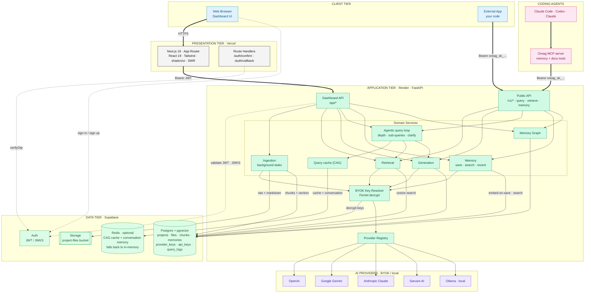
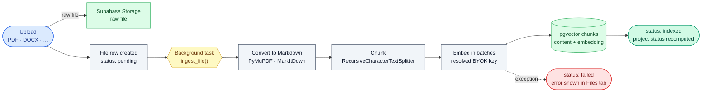
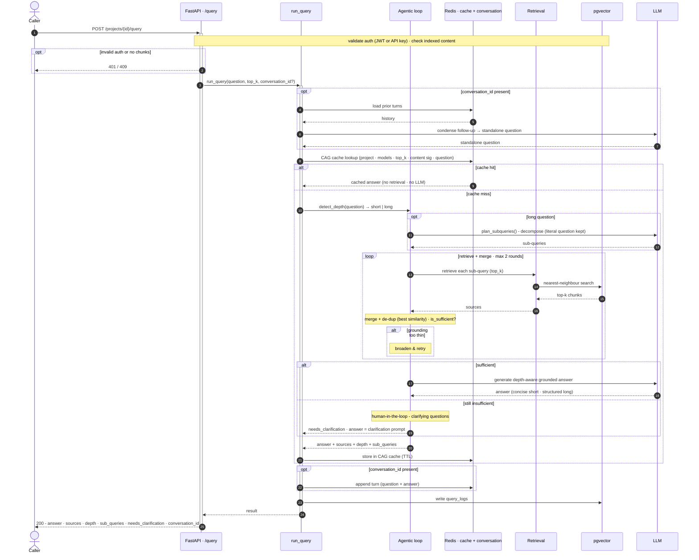
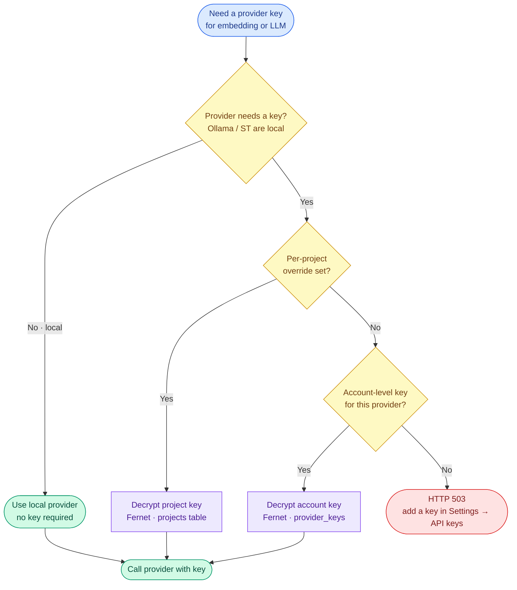
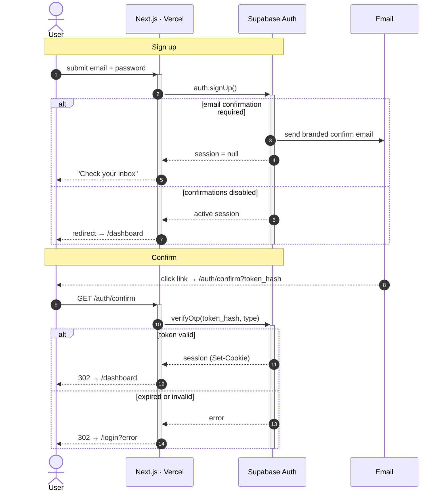
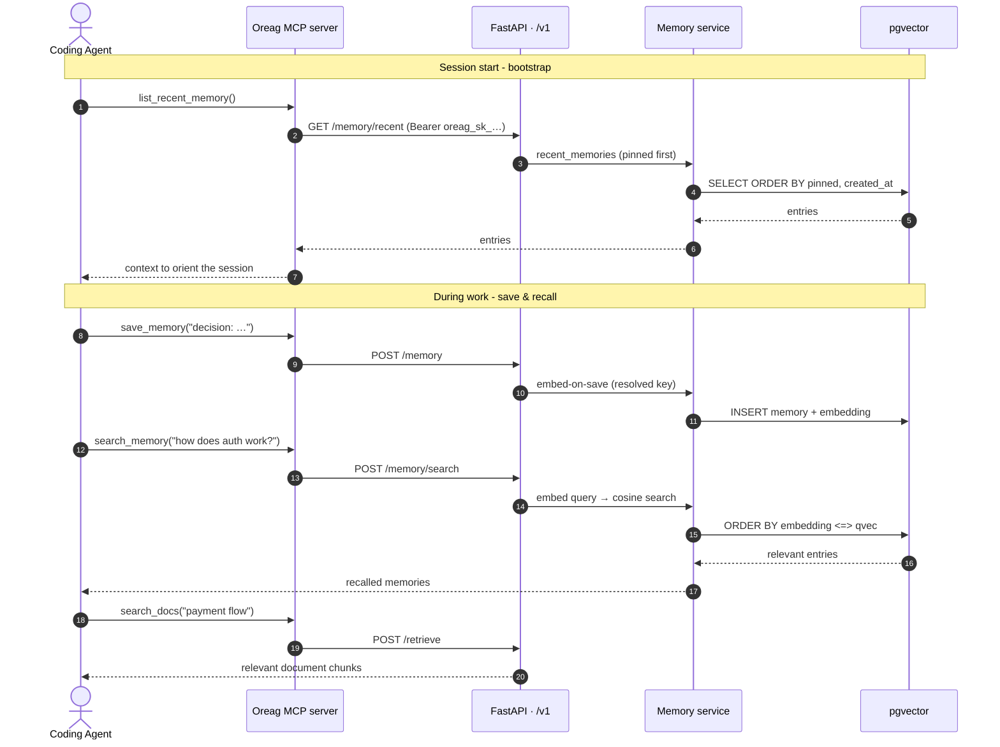

# Oreag - System & Flow Diagrams

> A structured redesign of the system architecture and the four core flows.
> **Same logic as the source diagrams** - every node, branch, and path is preserved -
> reorganised into a consistent visual grammar with colour-coded tiers, typed
> connectors, and inline endpoint annotations.

All diagrams are [Mermaid](https://mermaid.js.org/) and render directly on GitHub,
GitLab, VS Code, Obsidian, and most Markdown viewers.

---

## Legend

| Connector | Meaning |
|---|---|
| `A ==> B` (thick) | Primary request path |
| `A --> B` (solid) | Data read / write · internal call |
| `A -.-> B` (dotted) | Authentication |

| Tier | Colour |
|---|---|
| Client | 🟦 sky |
| Coding agents · MCP | 🩷 rose |
| Presentation · Vercel | ⬜ zinc |
| Application · Render · FastAPI | 🟩 emerald |
| Data · Supabase | 🟢 green |
| AI providers · BYOK / local | 🟪 violet |

**Shapes** - `([stadium])` start/end · `[process]` · `{decision}` · `{{task}}` · `[(datastore)]` · `[[storage]]`

### Contents

| # | Diagram | Type |
|---|---|---|
| 1 | [System Architecture](#1-system-architecture) | layered flowchart |
| 2 | [Document Ingestion](#2-document-ingestion--write-path) | write path |
| 3 | [Query / RAG](#3-query--rag--read-path) | sequence |
| 4 | [BYOK Key Resolution](#4-byok-key-resolution) | decision tree |
| 5 | [Authentication & Email Confirmation](#5-authentication--email-confirmation) | sequence |
| 6 | [Agent Memory & Docs Recall (MCP)](#6-agent-memory--docs-recall-mcp) | sequence |

---

## 1. System Architecture

Five colour-coded tiers from browser to AI provider. Thick arrows are primary
request paths; solid arrows are data/internal calls; dotted arrows are
authentication.

---

## 2. Document Ingestion · write path

An uploaded file is stored, a row is created, then a background task
**converts → chunks → embeds → writes vectors**. Any exception during embedding
flips the file to `failed`.

---

## 3. Query / RAG · read path

A caller hits either endpoint (dashboard `/api/projects/{id}/query` or public
`/v1/projects/{id}/query` - both run the same `run_query()`). When a
`conversation_id` is present the follow-up is condensed to a standalone question;
the CAG cache is checked first; depth is classified; a long question is decomposed
into sub-queries and each is retrieved + merged; a sufficiency check either grounds
a depth-aware answer or returns a human clarification (with a retry/broaden loop);
then the answer is cached, the conversation turn appended, and `query_logs` written.

---

## 4. BYOK Key Resolution

When an embedding or LLM call needs a provider key, the resolver checks in order:
**local provider** (no key) → **per-project override** → **account-level key** →
otherwise **503**.

---

## 5. Authentication & Email Confirmation

Sign-up branches on whether email confirmation is required; confirmation branches
on whether the OTP token is still valid.

---

## 6. Agent Memory & Docs Recall (MCP)

A coding-agent session connects to one project through the MCP server (project
`oreag_sk_` key) and persists / recalls memory and pulls document context across
sessions. Bootstrap at start, then save & recall during work.

MCP tools: `save_memory`, `search_memory`, `list_recent_memory`, `delete_memory`,
`search_docs`, `ask_docs`. Connect an agent via `mcp-server/README.md`.

---

Oreag architecture - structured diagram set · logic preserved from source.
