# Oreag - System & Flow Diagrams

> A structured redesign of the system architecture and the four core flows.
> **Same logic as the source diagrams** - every node, branch, and path is preserved -
> reorganised into a consistent visual grammar with colour-coded tiers, typed
> connectors, and inline endpoint annotations.

All diagrams are [Mermaid](https://mermaid.js.org/) and render directly on GitHub,
GitLab, VS Code, Obsidian, and most Markdown viewers.

---

## Legend

| Connector | Meaning |
|---|---|
| `A ==> B` (thick) | Primary request path |
| `A --> B` (solid) | Data read / write · internal call |
| `A -.-> B` (dotted) | Authentication |

| Tier | Colour |
|---|---|
| Client | 🟦 sky |
| Coding agents · MCP | 🩷 rose |
| Presentation · Vercel | ⬜ zinc |
| Application · Render · FastAPI | 🟩 emerald |
| Data · Supabase | 🟢 green |
| AI providers · BYOK / local | 🟪 violet |

**Shapes** - `([stadium])` start/end · `[process]` · `{decision}` · `{{task}}` · `[(datastore)]` · `[[storage]]`

### Contents

| # | Diagram | Type |
|---|---|---|
| 1 | [System Architecture](#1-system-architecture) | layered flowchart |
| 2 | [Document Ingestion](#2-document-ingestion--write-path) | write path |
| 3 | [Query / RAG](#3-query--rag--read-path) | sequence |
| 4 | [BYOK Key Resolution](#4-byok-key-resolution) | decision tree |
| 5 | [Authentication & Email Confirmation](#5-authentication--email-confirmation) | sequence |
| 6 | [Agent Memory & Docs Recall (MCP)](#6-agent-memory--docs-recall-mcp) | sequence |
| 7 | [Streaming answers · SSE](#7-streaming-answers--sse) | sequence |
| 8 | [Admission control](#8-admission-control--rate-limits-quotas-metering) | decision tree |
| 9 | [Structural scale](#9-structural-scale--indexes-pooling-fleet-wide-locks) | decision tree |
| 10 | [Passkeys, codes and two-factor](#10-passkeys-codes-and-two-factor) | decision tree + sequence |

---

## 1. System Architecture

Five colour-coded tiers from browser to AI provider. Thick arrows are primary
request paths; solid arrows are data/internal calls; dotted arrows are
authentication.

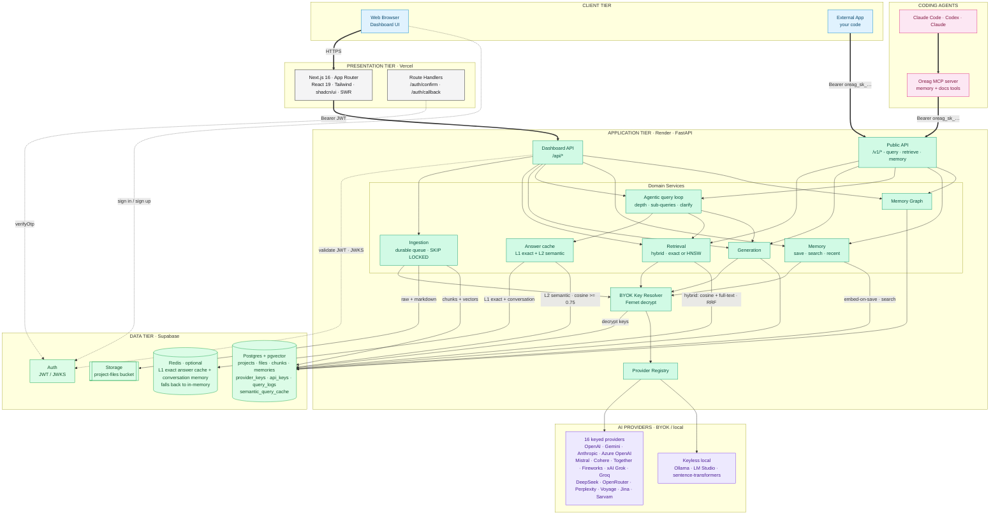
```mermaid
flowchart TB
    subgraph client["CLIENT TIER"]
        direction LR
        Browser["Web Browser<br/>Dashboard UI"]
        ExtApp["External App<br/>your code"]
    end

    subgraph agents["CODING AGENTS"]
        direction LR
        Agent["Claude Code · Codex · Claude"]
        MCP["Oreag MCP server<br/>memory + docs tools"]
    end

    subgraph edge["PRESENTATION TIER · Vercel"]
        direction LR
        Next["Next.js 16 · App Router<br/>React 19 · Tailwind · shadcn/ui · SWR"]
        AuthRt["Route Handlers<br/>/auth/confirm · /auth/callback"]
    end

    subgraph appt["APPLICATION TIER · Render · FastAPI"]
        API["Dashboard API<br/>/api/*"]
        PublicAPI["Public API<br/>/v1/* - query · retrieve · memory"]
        subgraph services["Domain Services"]
            direction LR
            Ingest["Ingestion<br/>durable queue · SKIP LOCKED"]
            Retrieve["Retrieval<br/>hybrid · exact or HNSW"]
            Generate["Generation"]
            Agentic["Agentic query loop<br/>depth · sub-queries · clarify"]
            QCache["Answer cache<br/>L1 exact + L2 semantic"]
            Memory["Memory<br/>save · search · recent"]
            MemGraph["Memory Graph"]
        end
        Resolver["BYOK Key Resolver<br/>Fernet decrypt"]
        Registry["Provider Registry"]
    end

    subgraph datat["DATA TIER · Supabase"]
        direction LR
        Auth["Auth<br/>JWT / JWKS"]
        PG[("Postgres + pgvector<br/>projects · files · chunks · memories<br/>provider_keys · api_keys · query_logs<br/>semantic_query_cache")]
        Store[["Storage<br/>project-files bucket"]]
        Redis[("Redis · optional<br/>L1 exact answer cache + conversation memory<br/>falls back to in-memory")]
    end

    subgraph ai["AI PROVIDERS · BYOK / local"]
        direction LR
        Keyed["16 keyed providers<br/>OpenAI · Gemini · Anthropic · Azure OpenAI<br/>Mistral · Cohere · Together · Fireworks · xAI Grok · Groq<br/>DeepSeek · OpenRouter · Perplexity · Voyage · Jina · Sarvam"]
        Local["Keyless local<br/>Ollama · LM Studio · sentence-transformers"]
    end

    %% --- primary request paths ---
    Browser ==>|HTTPS| Next
    Next ==>|"Bearer JWT"| API
    ExtApp ==>|"Bearer oreag_sk_…"| PublicAPI
    Agent ==> MCP
    MCP ==>|"Bearer oreag_sk_…"| PublicAPI

    %% --- authentication (dotted) ---
    Browser -.->|"sign in / sign up"| Auth
    AuthRt  -.->|verifyOtp| Auth
    API     -.->|"validate JWT · JWKS"| Auth

    %% --- application fan-out ---
    API --> Ingest & Retrieve & Generate & Agentic & Memory & MemGraph
    PublicAPI --> Retrieve & Generate & Agentic & Memory & MemGraph

    %% --- agentic query loop + answer cache ---
    Agentic --> QCache & Retrieve & Generate
    QCache -->|"L1 exact + conversation"| Redis
    QCache -->|"L2 semantic · cosine >= 0.75"| PG

    %% --- BYOK resolution & provider calls ---
    Ingest & Retrieve & Generate & Memory --> Resolver
    Resolver -->|"decrypt keys"| PG
    Resolver --> Registry
    Registry --> Keyed & Local

    %% --- data reads / writes ---
    Ingest   -->|"raw + markdown"| Store
    Ingest   -->|"chunks + vectors"| PG
    Retrieve -->|"hybrid: cosine + full-text · RRF"| PG
    Generate --> PG
    Memory   -->|"embed-on-save · search"| PG
    MemGraph --> PG

    classDef tClient fill:#e0f2fe,stroke:#0284c7,color:#0c4a6e
    classDef tAgent  fill:#fce7f3,stroke:#db2777,color:#831843
    classDef tEdge   fill:#f4f4f5,stroke:#18181b,color:#18181b
    classDef tApp    fill:#d1fae5,stroke:#059669,color:#064e3b
    classDef tData   fill:#dcfce7,stroke:#16a34a,color:#14532d
    classDef tAI     fill:#ede9fe,stroke:#7c3aed,color:#4c1d95

    class Browser,ExtApp tClient
    class Agent,MCP tAgent
    class Next,AuthRt tEdge
    class API,PublicAPI,Ingest,Retrieve,Generate,Agentic,QCache,Memory,MemGraph,Resolver,Registry tApp
    class Auth,PG,Store,Redis tData
    class Keyed,Local tAI
```

---

## 2. Document Ingestion · write path

An uploaded file is stored, a row is created, then a background task
**converts → chunks → embeds → writes vectors**. Embedding batches are sized
per provider (OpenAI / Gemini 100 · Ollama 32 · sentence-transformers 64).
Any exception during embedding flips the file to `failed`.

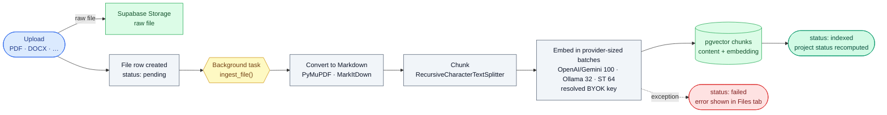
```mermaid
flowchart LR
    A(["Upload<br/>PDF · DOCX · …"]) -->|"raw file"| B["Supabase Storage<br/>raw file"]
    A --> C["File row created<br/>status: pending"]
    C --> D{{"Background task<br/>ingest_file()"}}
    D --> E["Convert to Markdown<br/>PyMuPDF · MarkItDown"]
    E --> F["Chunk<br/>RecursiveCharacterTextSplitter"]
    F --> G["Embed in provider-sized batches<br/>OpenAI/Gemini 100 · Ollama 32 · ST 64<br/>resolved BYOK key"]
    G --> H[("pgvector chunks<br/>content + embedding")]
    H --> I(["status: indexed<br/>project status recomputed"])
    G -.->|exception| J(["status: failed<br/>error shown in Files tab"])

    classDef start fill:#dbeafe,stroke:#2563eb,color:#1e3a8a
    classDef proc  fill:#f1f5f9,stroke:#475569,color:#0f172a
    classDef task  fill:#fef9c3,stroke:#ca8a04,color:#713f12
    classDef store fill:#dcfce7,stroke:#16a34a,color:#14532d
    classDef ok    fill:#d1fae5,stroke:#059669,color:#064e3b
    classDef bad   fill:#fee2e2,stroke:#dc2626,color:#7f1d1d

    class A start
    class B,H store
    class C,E,F,G proc
    class D task
    class I ok
    class J bad
```

**Re-indexing** - shrinking a Matryoshka-capable model to a smaller dimension
truncates stored vectors **in place** (chunks and memories) instantly, with zero
re-embedding. Growing the dimension or switching models triggers a full
re-embed: memory embeddings are cleared and queued for re-embedding with the new
model first, then every file is re-ingested in the background.

---

## 3. Query / RAG · read path

A caller hits either endpoint (dashboard `/api/projects/{id}/query` or public
`/v1/projects/{id}/query` - both run the same `run_query()`). When a
`conversation_id` is present the follow-up is condensed to a standalone question;
the L1 exact-match cache is checked first, then the L2 semantic cache (a cached
question with cosine similarity >= 0.75 answers the new one for the cost of a
single embedding call); on a double miss depth is classified; a long question is
decomposed into sub-queries and each is retrieved with **hybrid search**
(semantic pgvector + lexical full-text, rankings fused with Reciprocal Rank
Fusion, k=60 - degrades to semantic-only if the lexical column is missing) and
blended with relevant memories; a sufficiency check either grounds a depth-aware
answer or returns a human clarification (with a retry/broaden loop); then the
answer is stored back to **both** L1 and L2, the conversation turn appended, and
`query_logs` written. Responses carry `cache_layer` (`"l1"` · `"l2"` · `null`)
and `cache_similarity`; sources still report cosine similarity - RRF only orders.

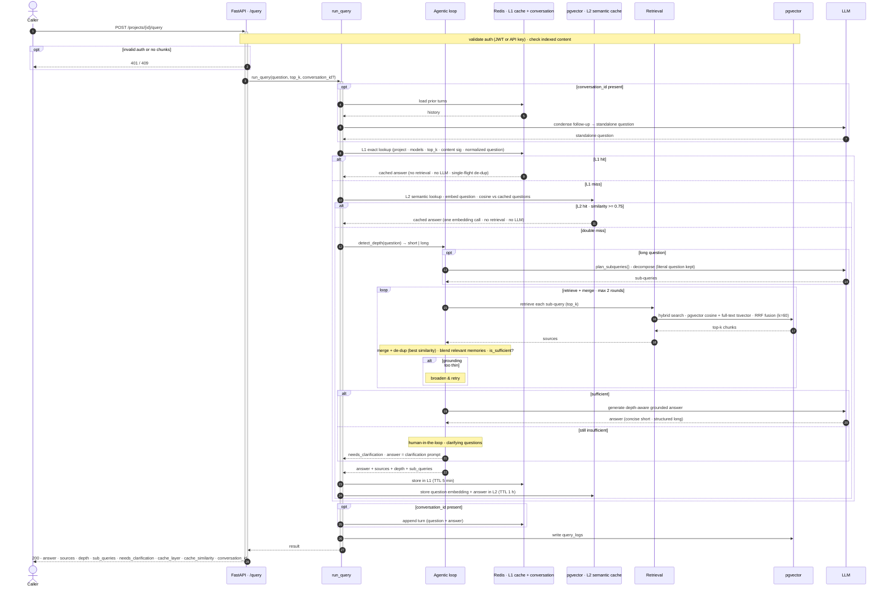
```mermaid
sequenceDiagram
    autonumber
    actor C as Caller
    participant API as FastAPI · /query
    participant Q as run_query
    participant AG as Agentic loop
    participant CC as Redis · L1 cache + conversation
    participant SC as pgvector · L2 semantic cache
    participant R as Retrieval
    participant DB as pgvector
    participant L as LLM

    C->>+API: POST /projects/{id}/query
    Note over API,DB: validate auth (JWT or API key) · check indexed content
    opt invalid auth or no chunks
        API-->>C: 401 / 409
    end
    API->>+Q: run_query(question, top_k, conversation_id?)

    opt conversation_id present
        Q->>CC: load prior turns
        CC-->>Q: history
        Q->>L: condense follow-up → standalone question
        L-->>Q: standalone question
    end

    Q->>CC: L1 exact lookup (project · models · top_k · content sig · normalized question)
    alt L1 hit
        CC-->>Q: cached answer (no retrieval · no LLM · single-flight de-dup)
    else L1 miss
        Q->>SC: L2 semantic lookup - embed question · cosine vs cached questions
        alt L2 hit · similarity >= 0.75
            SC-->>Q: cached answer (one embedding call · no retrieval · no LLM)
        else double miss
            Q->>AG: detect_depth(question) → short | long
            opt long question
                AG->>L: plan_subqueries() - decompose (literal question kept)
                L-->>AG: sub-queries
            end
            loop retrieve + merge · max 2 rounds
                AG->>R: retrieve each sub-query (top_k)
                R->>DB: hybrid search - pgvector cosine + full-text tsvector · RRF fusion (k=60)
                DB-->>R: top-k chunks
                R-->>AG: sources
                Note over AG: merge + de-dup (best similarity) · blend relevant memories · is_sufficient?
                alt grounding too thin
                    Note over AG: broaden & retry
                end
            end
            alt sufficient
                AG->>L: generate depth-aware grounded answer
                L-->>AG: answer (concise short · structured long)
            else still insufficient
                Note over AG: human-in-the-loop - clarifying questions
                AG-->>Q: needs_clarification · answer = clarification prompt
            end
            AG-->>Q: answer + sources + depth + sub_queries
            Q->>CC: store in L1 (TTL 5 min)
            Q->>SC: store question embedding + answer in L2 (TTL 1 h)
        end
    end

    opt conversation_id present
        Q->>CC: append turn (question + answer)
    end
    Q->>DB: write query_logs
    Q-->>-API: result
    API-->>-C: 200 - answer · sources · depth · sub_queries · needs_clarification · cache_layer · cache_similarity · conversation_id
```

---

## 4. BYOK Key Resolution

When an embedding or LLM call needs a provider key, the resolver checks in order:
**local provider** (no key) → **per-project override** → **account-level key** →
otherwise **503**.

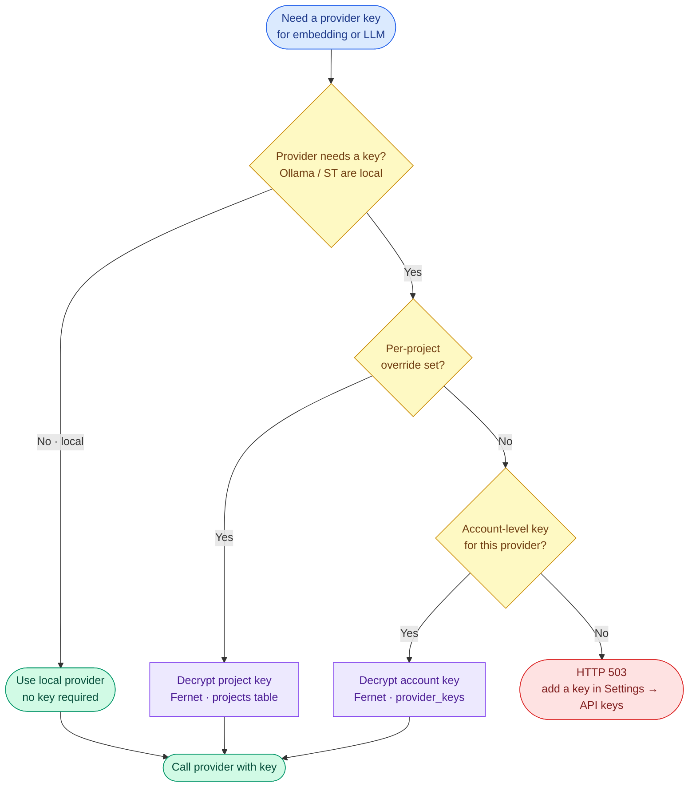
```mermaid
flowchart TD
    S(["Need a provider key<br/>for embedding or LLM"]) --> Q1{"Provider needs a key?<br/>Ollama / ST are local"}
    Q1 -->|"No · local"| Local(["Use local provider<br/>no key required"])
    Q1 -->|Yes| Q2{"Per-project<br/>override set?"}
    Q2 -->|Yes| D1["Decrypt project key<br/>Fernet · projects table"]
    Q2 -->|No| Q3{"Account-level key<br/>for this provider?"}
    Q3 -->|Yes| D2["Decrypt account key<br/>Fernet · provider_keys"]
    Q3 -->|No| Err(["HTTP 503<br/>add a key in Settings → API keys"])
    D1 --> Use(["Call provider with key"])
    D2 --> Use
    Local --> Use

    classDef start    fill:#dbeafe,stroke:#2563eb,color:#1e3a8a
    classDef decision fill:#fef9c3,stroke:#ca8a04,color:#713f12
    classDef action   fill:#ede9fe,stroke:#7c3aed,color:#4c1d95
    classDef ok       fill:#d1fae5,stroke:#059669,color:#064e3b
    classDef bad      fill:#fee2e2,stroke:#dc2626,color:#7f1d1d

    class S start
    class Q1,Q2,Q3 decision
    class D1,D2 action
    class Use,Local ok
    class Err bad
```

---

## 5. Authentication & Email Confirmation

Sign-up branches on whether email confirmation is required; confirmation branches
on whether the OTP token is still valid.

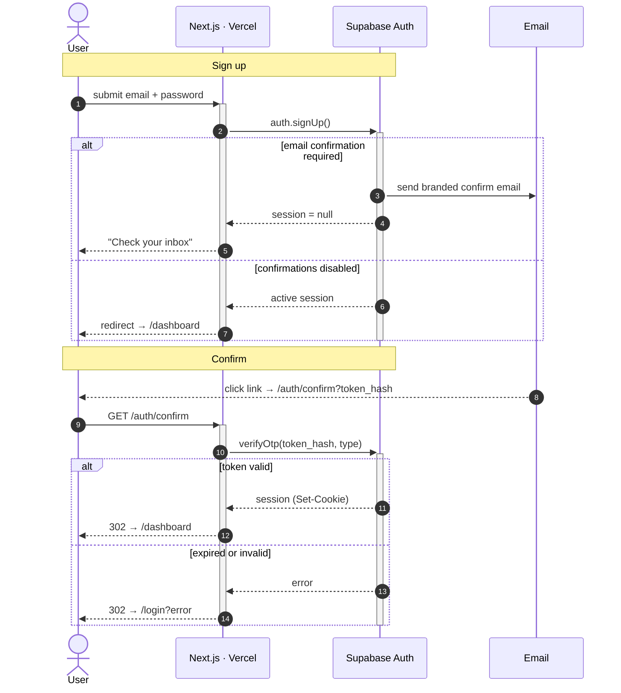
```mermaid
sequenceDiagram
    autonumber
    actor U as User
    participant FE as Next.js · Vercel
    participant SB as Supabase Auth
    participant M as Email

    Note over U,SB: Sign up
    U->>+FE: submit email + password
    FE->>+SB: auth.signUp()
    alt email confirmation required
        SB->>M: send branded confirm email
        SB-->>FE: session = null
        FE-->>U: "Check your inbox"
    else confirmations disabled
        SB-->>FE: active session
        FE-->>U: redirect → /dashboard
    end
    deactivate SB
    deactivate FE

    Note over U,SB: Confirm
    M-->>U: click link → /auth/confirm?token_hash
    U->>+FE: GET /auth/confirm
    FE->>+SB: verifyOtp(token_hash, type)
    alt token valid
        SB-->>FE: session (Set-Cookie)
        FE-->>U: 302 → /dashboard
    else expired or invalid
        SB-->>FE: error
        FE-->>U: 302 → /login?error
    end
    deactivate SB
    deactivate FE
```

---

## 6. Agent Memory & Docs Recall (MCP)

A coding-agent session connects to one project through the MCP server (project
`oreag_sk_` key) and persists / recalls memory and pulls document context across
sessions. Bootstrap at start, then save & recall during work.

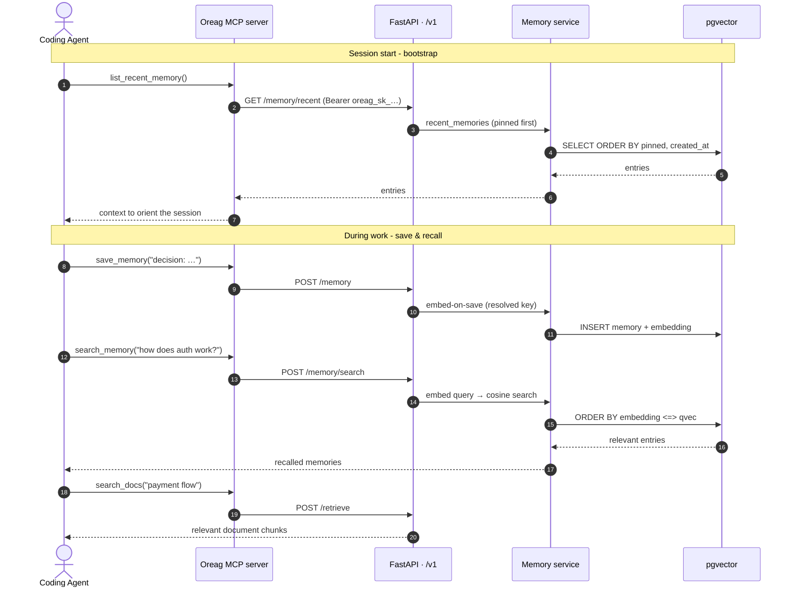
```mermaid
sequenceDiagram
    autonumber
    actor A as Coding Agent
    participant MCP as Oreag MCP server
    participant API as FastAPI · /v1
    participant M as Memory service
    participant DB as pgvector

    Note over A,DB: Session start - bootstrap
    A->>MCP: list_recent_memory()
    MCP->>API: GET /memory/recent (Bearer oreag_sk_…)
    API->>M: recent_memories (pinned first)
    M->>DB: SELECT ORDER BY pinned, created_at
    DB-->>M: entries
    M-->>MCP: entries
    MCP-->>A: context to orient the session

    Note over A,DB: During work - save & recall
    A->>MCP: save_memory("decision: …")
    MCP->>API: POST /memory
    API->>M: embed-on-save (resolved key)
    M->>DB: INSERT memory + embedding
    A->>MCP: search_memory("how does auth work?")
    MCP->>API: POST /memory/search
    API->>M: embed query → cosine search
    M->>DB: ORDER BY embedding <=> qvec
    DB-->>M: relevant entries
    M-->>A: recalled memories
    A->>MCP: search_docs("payment flow")
    MCP->>API: POST /retrieve
    API-->>A: relevant document chunks
```

MCP tools (9): `save_memory`, `search_memory`, `list_recent_memory`,
`delete_memory`, `search_docs`, `ask_docs`, `add_document`, `get_memory_graph`,
`explore_brain`. Connect an agent via `mcp-server/README.md`.

---

## 7. Streaming answers · SSE

`POST /v1/projects/{id}/query/stream` and the dashboard playground stream the
answer token by token. Same brain, same caches, same agentic loop as `/query` -
only the final generation is streamed.

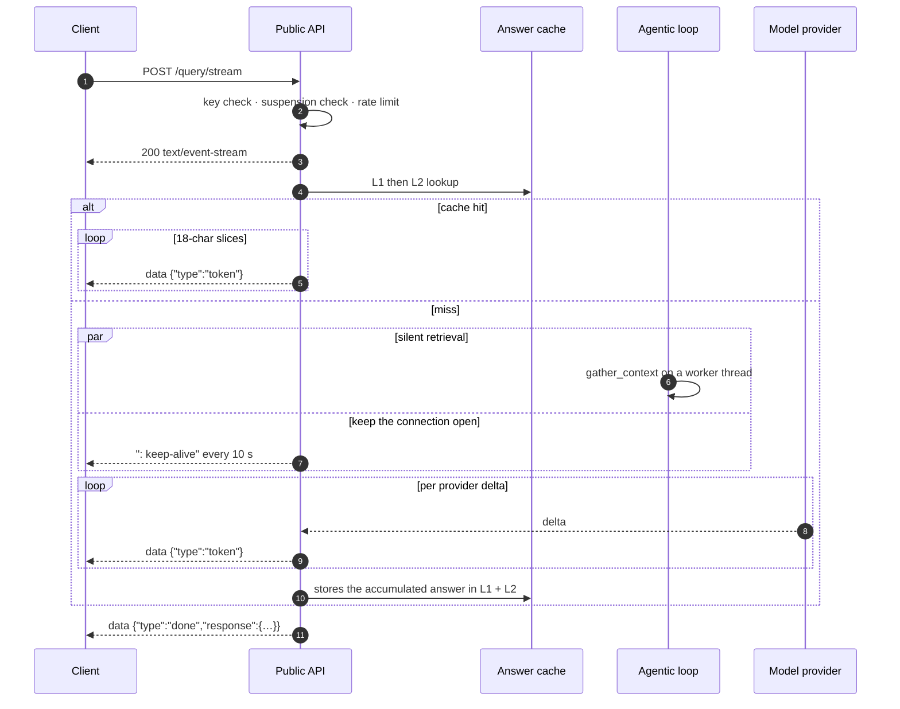
```mermaid
sequenceDiagram
    autonumber
    participant C as Client
    participant API as Public API
    participant AC as Answer cache
    participant AG as Agentic loop
    participant P as Model provider

    C->>API: POST /query/stream
    API->>API: key check · suspension check · rate limit
    API-->>C: 200 text/event-stream
    API->>AC: L1 then L2 lookup
    alt cache hit
        loop 18-char slices
            API-->>C: data {"type":"token"}
        end
    else miss
        par silent retrieval
            AG->>AG: gather_context on a worker thread
        and keep the connection open
            API-->>C: ": keep-alive" every 10 s
        end
        loop per provider delta
            P-->>API: delta
            API-->>C: data {"type":"token"}
        end
        API->>AC: stores the accumulated answer in L1 + L2
    end
    API-->>C: data {"type":"done","response":{…}}
```

Errors arrive as `{"type":"error"}` frames, never as an HTTP status - the 200 was
already sent. Native streaming: OpenAI and OpenAI-compatible vendors, Anthropic,
Gemini, Sarvam, Ollama; anything else yields one full-answer frame.

---

## 8. Admission control · rate limits, quotas, metering

Every `/v1` request passes the same gate before any work happens, and leaves a
metering row behind.

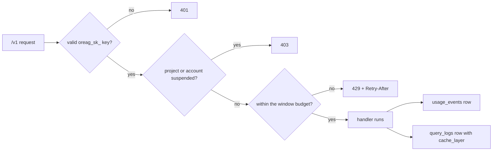
```mermaid
flowchart LR
    REQ["/v1 request"] --> K{"valid oreag_sk_ key?"}
    K -- no --> R401["401"]
    K -- yes --> S{"project or account suspended?"}
    S -- yes --> R403["403"]
    S -- no --> RL{"within the window budget?"}
    RL -- no --> R429["429 + Retry-After"]
    RL -- yes --> WORK["handler runs"]
    WORK --> U["usage_events row"]
    WORK --> QL["query_logs row with cache_layer"]
```

| Bucket | Endpoints | Per key | Per project |
|---|---|---|---|
| standard | query, query/stream, retrieve, memory* | 120/min | 300/min |
| heavy | explore, memory-graph | 10/min | 20/min |

Uploads are additionally capped at 20 files per request, 60 files/minute and
1,000 files per project, counted inside `pg_advisory_xact_lock` so concurrent
keys cannot overshoot. Memories cap at 2,000 per project. The limiter **fails
open**: if its counter store is unreachable the request proceeds rather than
erroring.

---

## 9. Structural scale · indexes, pooling, fleet-wide locks

None of this changes a single response. Same request, same answer, same
`similarity` values - these are the things that decide whether the system can
serve a thousand of them at once. The shared rule is that **every fast path is
an optimisation that may be declined**, never something correctness depends on.

### 9.1 Exact or approximate vector search

`chunks.embedding` is a dimensionless `vector`, so one table holds every
project's embedding size and no plain index is possible. Migration 0018 adds one
**partial** HNSW index per dimension instead. Routing a query onto them is a
decision with four gates, checked cheapest first:

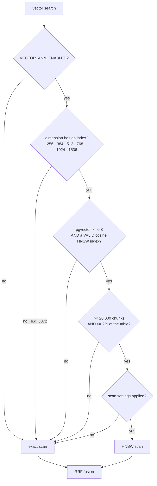
```mermaid
flowchart TD
    Q["vector search"] --> G1{"VECTOR_ANN_ENABLED?"}
    G1 -- no --> EX["exact scan"]
    G1 -- yes --> G2{"dimension has an index?<br/>256 · 384 · 512 · 768 · 1024 · 1536"}
    G2 -- "no · e.g. 3072" --> EX
    G2 -- yes --> G3{"pgvector >= 0.8<br/>AND a VALID cosine HNSW index?"}
    G3 -- no --> EX
    G3 -- yes --> G4{">= 20,000 chunks<br/>AND >= 2% of the table?"}
    G4 -- no --> EX
    G4 -- yes --> G5{"scan settings applied?"}
    G5 -- no --> EX
    G5 -- yes --> ANN["HNSW scan"]
    EX --> RRF["RRF fusion"]
    ANN --> RRF
```

**Why both size gates.** Every statement is `WHERE project_id = X ORDER BY
embedding <=> q LIMIT k`, and a global HNSW index knows nothing about
`project_id`, so it must **post-filter**. Recall therefore depends on the
project's *share* of indexed rows, while the exact scan's cost depends on its
*absolute size*. A small project inside a big table gets an exact scan that is
both fast and perfect, where HNSW would burn its candidate budget on other
tenants' rows.

**Why 3072 is excluded.** pgvector caps HNSW at 2,000 dimensions for `vector`.
The `halfvec` workaround would drop to half precision and change the distance
arithmetic - and therefore change the `similarity` value that
`agentic_min_similarity`, `rag_memory_min_similarity` and the UI's match % all
read. A 3072-dimension project keeps the exact scan. Since every 3072 model is
Matryoshka, shrinking it to 1536 or 1024 in Settings is an in-place `UPDATE`
that makes it indexable without re-embedding anything.

| Dimension | Indexed | Notes |
|---|---|---|
| 256, 384, 512, 768, 1024, 1536 | yes | one partial index each, `m=16`, `ef_construction=64` |
| 3072 | no | over pgvector's 2,000-dimension HNSW limit; always exact |
| memories (any size) | no | capped at 2,000 rows per project, so exact is bounded and perfect |

Scan settings are applied with `SET LOCAL`, so they revert at the end of the
transaction and cannot leak across the shared pool:
`hnsw.iterative_scan=relaxed_order`, `ef_search=100`, `max_scan_tuples=40000`.
The capability probe is memoized for 5 minutes, so a newly built index takes
effect without a restart and a dropped one closes the gate within the same
window. **Every** unexpected condition - no pgvector, old pgvector, an invalid
index, an unknown dimension, a probe error - returns "use the exact SQL".

### 9.2 Connection release during provider I/O

A completion blocks for seconds; a streamed one, sometimes minutes. It needs no
database at all, but holding the pooled connection across that wait is what
drains the pool under load - idle, yet nobody else can have it.

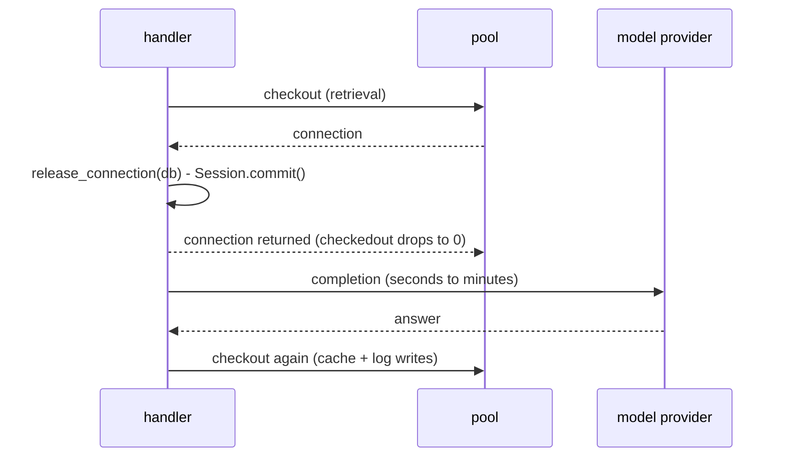
```mermaid
sequenceDiagram
    participant H as handler
    participant P as pool
    participant M as model provider

    H->>P: checkout (retrieval)
    P-->>H: connection
    H->>H: release_connection(db) - Session.commit()
    H-->>P: connection returned (checkedout drops to 0)
    H->>M: completion (seconds to minutes)
    M-->>H: answer
    H->>P: checkout again (cache + log writes)
```

`Session.commit()` ends the transaction and checks the connection back in; the
session transparently checks a fresh one out on its next statement.
`expire_on_commit=False` keeps loaded ORM values across the release. On the
failure branch `rollback()` expires them *regardless* of that flag, so the
loaded values are snapshotted and restored around it - a release never changes
what a loaded object says. `DB_RELEASE_DURING_PROVIDER_IO=false` restores the
old hold-for-the-whole-request behaviour with an env change and a restart.

The accepted trade: post-generation cache and log writes now re-acquire a
connection, so they can hit `pool_timeout` where before they could not fail.

### 9.3 Pooling

`DATABASE_URL` points at the Supabase **transaction pooler**, which holds a
server connection only for the length of a transaction rather than a session.
Two consequences the code handles: `prepare_threshold=None`, because
consecutive transactions can land on different backends; and the client pool
total (10 + 10 overflow = 20) must stay at or below the tenant Pool Size, or
waits queue invisibly *inside* Supavisor where `pool_timeout` cannot see them -
which would destroy the fast-fail `PoolTimeoutError` → 503 path.

DDL is the exception: session state only survives on the session pooler (5432),
which is what `MIGRATION_DATABASE_URL` is for.

### 9.4 Fleet-wide single-flight

The answer cache dedupes simultaneous identical asks. On Redis that
de-duplication is fleet-wide rather than per-process, so four workers asking the
same question cost one AI call, not four.

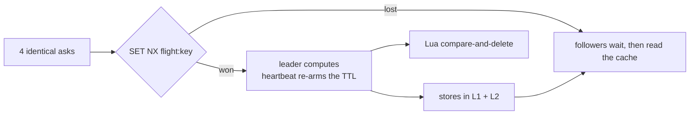
```mermaid
flowchart LR
    A["4 identical asks"] --> L{"SET NX flight:key"}
    L -- won --> LEAD["leader computes<br/>heartbeat re-arms the TTL"]
    L -- lost --> WAIT["followers wait, then read the cache"]
    LEAD --> STORE["stores in L1 + L2"]
    STORE --> WAIT
    LEAD --> REL["Lua compare-and-delete"]
```

The token in the lock is what makes release safe: a slow leader whose generation
outran the TTL must never delete the lock a *newer* leader has taken since, and
GET-then-DEL from Python has exactly that race - so the check runs inside Redis.
The heartbeat means the TTL bounds a leader that **died**, not one that is merely
slow, and a 5-TTL lease means a leaked acquire still cannot hold the lock
forever. If Redis is unreachable the lock **fails open** to the in-process one.

The lock key is the cache key, and `project.id` is its first element - so
single-flight is scoped **per project**, and two projects (or two accounts)
asking the identical question never share a lock or an answer.

---

### 8.1 Two surfaces, two budgets

The public API is metered per **API key** and per **project**. The signed-in
dashboard is metered per **user** - a person may own many projects, and the
thing worth bounding is what one account can spend per minute.

| Surface | Scope | Standard | Heavy |
|---|---|---|---|
| `/v1/*` (API key) | key + project | 120 / 300 | 10 / 20 |
| `/api/*` (dashboard) | user | 240 | 30 |

The dashboard budget is applied inside `get_current_user`, so every
authenticated route is covered by construction and one added tomorrow cannot
forget it. The provider-calling routes - playground query and stream,
memory-graph - additionally take `heavy_dashboard_limit`, so a burst of cheap
CRUD can never exhaust the expensive allowance.

Both fail **open**: if the counter store is unreachable the request proceeds. A
throttle that becomes an outage is worse than no throttle.

---

## 10. Passkeys, codes and two-factor

Authentication methods are **layered by strength, not stacked**: the strongest
method that succeeds ends the ceremony.

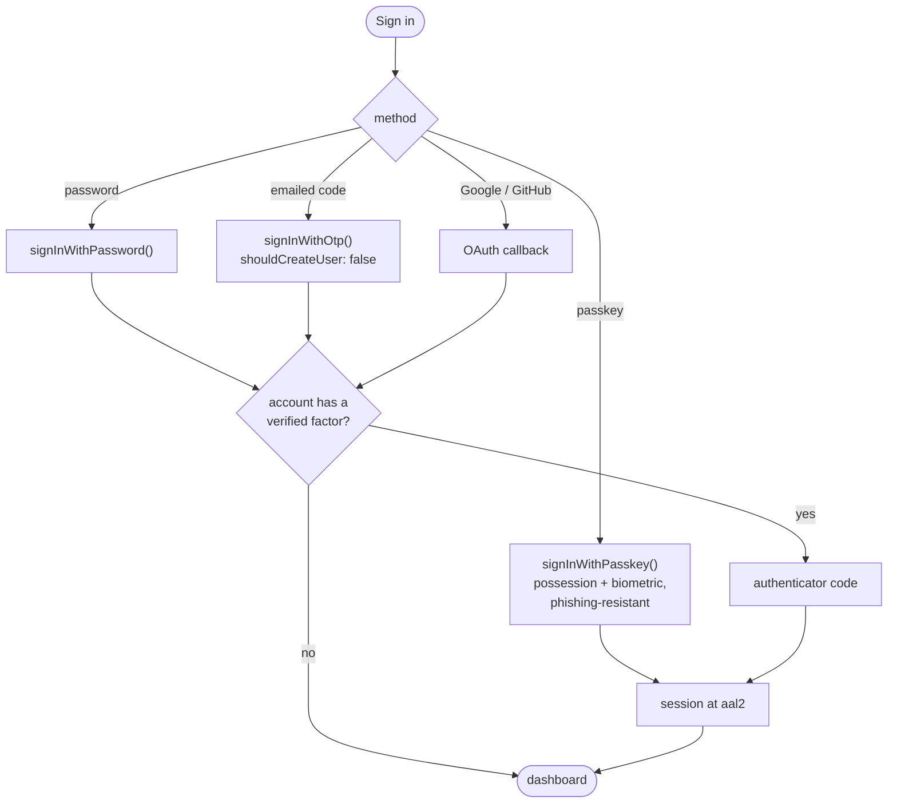
```mermaid
flowchart TD
    Start(["Sign in"]) --> Pick{"method"}
    Pick -- passkey --> PK["signInWithPasskey()<br/>possession + biometric,<br/>phishing-resistant"]
    Pick -- password --> PW["signInWithPassword()"]
    Pick -- emailed code --> OTP["signInWithOtp()<br/>shouldCreateUser: false"]
    Pick -- Google / GitHub --> OA["OAuth callback"]
    PK --> AAL2["session at aal2"]
    PW --> Gate
    OTP --> Gate
    OA --> Gate
    Gate{"account has a<br/>verified factor?"}
    Gate -- no --> Done(["dashboard"])
    Gate -- yes --> TOTP["authenticator code"]
    TOTP --> AAL2
    AAL2 --> Done
```

A passkey needs no second factor: it **is** two factors, and unlike a typed
code it cannot be replayed on a lookalike domain. Asking for a code after one
would add friction and no security.

### 10.1 Why the gate must be server-side

`getAuthenticatorAssuranceLevel()` in the browser decides whether to *show* the
prompt. That is a courtesy. An `aal1` access token lifted from the browser works
against the API with curl unless the API checks too.

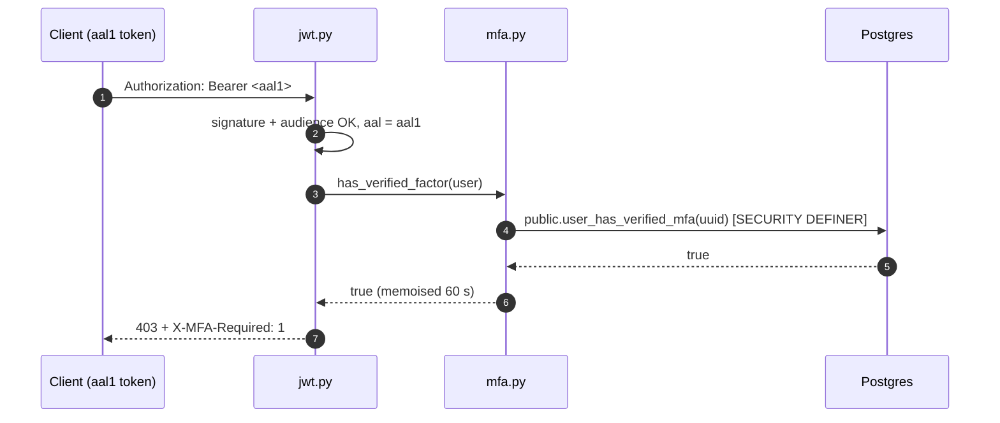
```mermaid
sequenceDiagram
    autonumber
    participant C as Client (aal1 token)
    participant J as jwt.py
    participant M as mfa.py
    participant D as Postgres

    C->>J: Authorization: Bearer <aal1>
    J->>J: signature + audience OK, aal = aal1
    J->>M: has_verified_factor(user)
    M->>D: public.user_has_verified_mfa(uuid)  [SECURITY DEFINER]
    D-->>M: true
    M-->>J: true (memoised 60 s)
    J-->>C: 403 + X-MFA-Required: 1
```

`aal1` alone is **not** grounds to reject - it is also the correct level for an
account with no second factor. The missing fact lives in `auth.mfa_factors`,
which the application role cannot read, so migration 0019 exposes exactly one
boolean through a `SECURITY DEFINER` function and nothing else about the
factors.

Three details that are load-bearing:

- **403, never 401.** The session is real; it just has not stepped up. A 401
  reads as signed-out to every client and triggers a re-login that lands in the
  identical state.
- **`X-MFA-Required` is a header, not a message.** Clients branch on it, so
  rewording the human text can never break the redirect.
- **It fails open.** A missing function (0019 unapplied) or a query error lets
  the request through. Failing closed would turn one bad migration into a
  silent, total lockout of every account that enabled two-factor.

Public `/v1` traffic authenticates with API keys through a different dependency
and is untouched - a key is not a person and has no second factor to present.

### 10.2 Codes alongside links

Every auth email carries `{{ .Token }}` **and** `{{ .ConfirmationURL }}`. The
code is typed; the link still works. Codes exist because links break when the
email is opened in a different browser from the one that started the flow, and
because scanners sometimes consume a one-time link before the human clicks it.

`verifyOtp` is one call with two carriers - `token_hash` from the link handler,
`token` from the six-digit field - so both paths converge on identical
behaviour.

Changing a password while signed in now requires `reauthenticate()` first and
passes the emailed nonce to `updateUser({ password, nonce })`. Before this, a
stolen live session could set a new password with no re-check at all, which
turned session theft into permanent account takeover.

---

Oreag architecture - structured diagram set · logic preserved from source.
