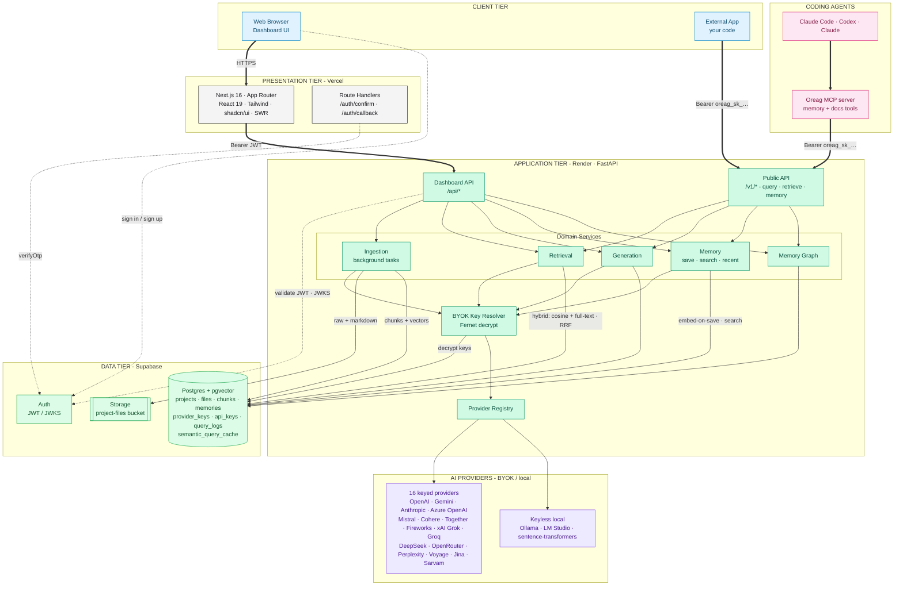
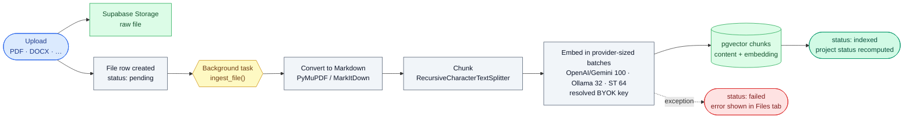
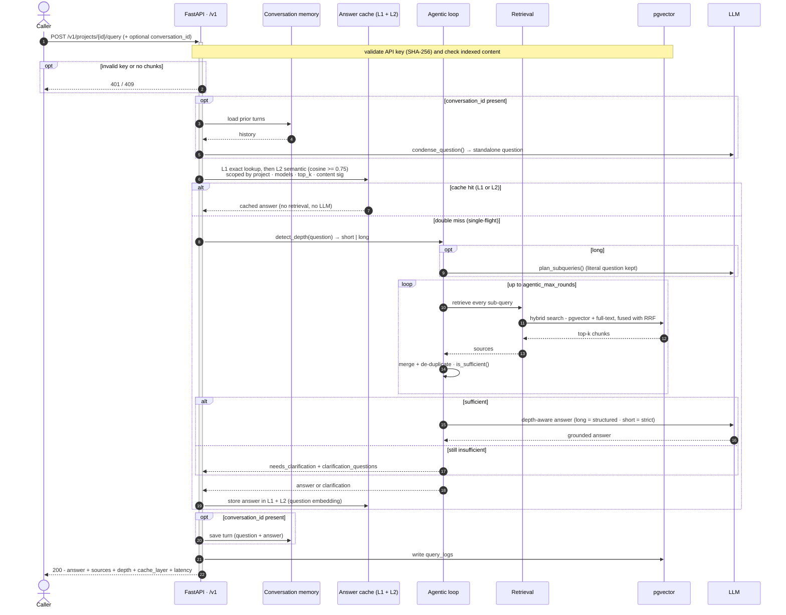
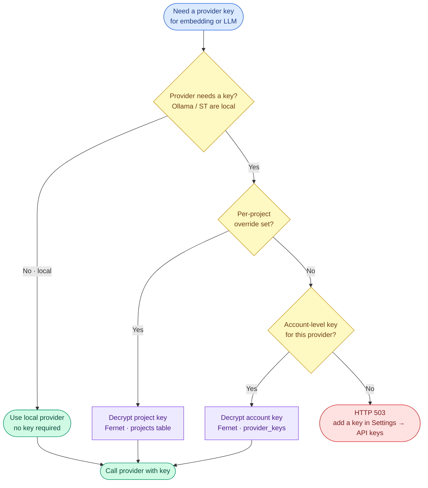
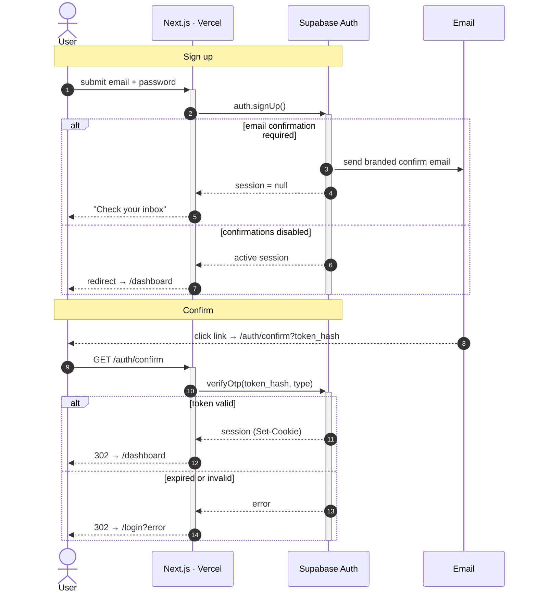
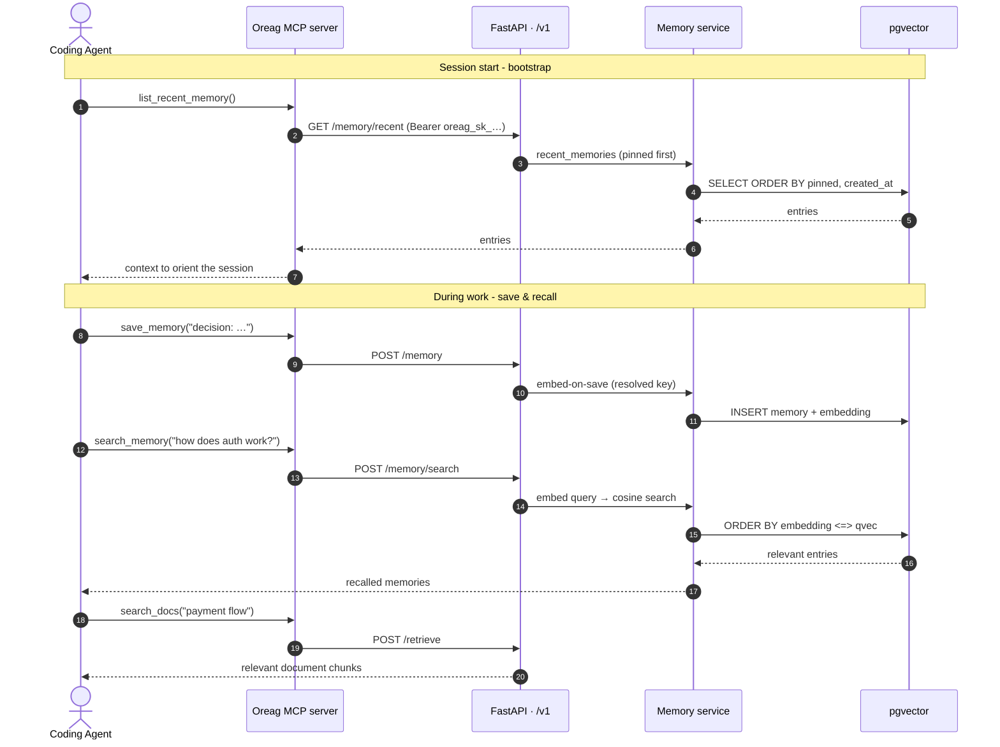

<div align="center">

# Oreag - RAG & Memory as a Service
https://playground.likec4.dev/share/foITvnUjbk/

**Turn your documents into a production-ready, queryable RAG API - with a built-in memory graph - from a web dashboard.**


</div>

---

## Overview

Oreag lets a user upload documents (PDF, DOCX, PPTX, HTML, CSV, …), tune chunking
and embedding settings, and instantly get a **dedicated, API-key-protected RAG
endpoint** to query that knowledge base from any application - plus an **agent
memory graph** derived from the same content. It is **multi-tenant** and
**bring-your-own-key (BYOK)**: each user supplies their own credentials for any
of 16 keyed providers (OpenAI, Gemini, Anthropic, Azure OpenAI, Mistral, Cohere,
and more) or runs a keyless local model (Ollama, LM Studio,
sentence-transformers), stored encrypted at rest.

## Features

- **Any document to an API** - upload, auto-convert to Markdown, chunk, embed, and serve.
- **Per-project RAG endpoint** - `POST /v1/projects/{id}/query` returns grounded answers with cited sources.
- **Agentic retrieval loop** - auto depth detection (short vs long), query decomposition for big/exam questions, multi-round retrieve-and-merge with a sufficiency check, and human-in-the-loop clarification instead of a dead "no reference".
- **Hybrid retrieval** - semantic pgvector search and lexical Postgres full-text search run together and are fused with Reciprocal Rank Fusion (RRF), so exact terms (error codes, IDs, names) embeddings fumble are still caught. Degrades to semantic-only automatically if the lexical column is missing.
- **Two-layer answer cache** - used by every query surface (playground, `/v1` API, MCP). L1 is an exact-match CAG cache in Redis (in-memory fallback, single-flight de-duplication, 5 min TTL); L2 is a semantic cache in Postgres/pgvector - a new question whose cosine similarity to an answered one is >= 0.75 is served from cache at the cost of one embedding call (1 h TTL). Both layers are scoped by project, models, top-K, and content signature, so new content or model changes invalidate automatically. Responses report `cache_layer` and `cache_similarity`.
- **Conversation memory** - server-side, keyed by an optional `conversation_id`, so follow-ups like "summarize that" are condensed into standalone questions before retrieval.
- **Agent memory graph** - a queryable graph of sections and entities derived from indexed content.
- **Agent memory (MCP)** - coding agents (Claude Code, Codex, Claude) save & recall per-project memory and pull document context through the Oreag MCP server.
- **Visualize tab** - a 3D interactive knowledge graph inside each project: the project, its files, chunks, and memories as nodes with structural and similarity edges - orbit/zoom, hover tooltips, and a click-through details panel with a "View file" action.
- **BYOK, multi-provider** - 16 keyed providers (OpenAI, Google Gemini, Anthropic, Azure OpenAI, Mistral, Cohere, Together AI, Fireworks AI, xAI Grok, Groq, DeepSeek, OpenRouter, Perplexity, Voyage AI, Jina AI, Sarvam) plus keyless local Ollama, LM Studio, and sentence-transformers. Keys encrypted with Fernet; per-account **and** per-project overrides.
- **Secure by design** - Supabase Auth (JWT/JWKS), Row-Level Security, SHA-256-hashed API keys, Fernet-encrypted provider keys.
- **Tunable** - chunk size/overlap (global or per-file), embedding model, LLM, top-K - with one-click re-index.
- **Matryoshka (MRL) dimensions** - MRL-capable embedding models (OpenAI text-embedding-3, gemini-embedding-001, Cohere embed-v4.0, Jina v3) offer multiple sizes; shrinking the same model truncates stored vectors (chunks **and** memories) in place instantly with zero re-embedding, while growing or switching models re-embeds everything.

---

## System Architecture

> Thick arrows are the primary request paths; dotted arrows are authentication. Each tier is colour-coded.



---

## Core Flows

### 1. Document Ingestion (write path)



### 2. Query / RAG (read path)



### 3. BYOK Key Resolution



### 4. Authentication & Email Confirmation



### 5. Agent Memory & Docs Recall (MCP)



---

## Tech Stack

| Layer | Technology |
|---|---|
| **Frontend** | Next.js 16 (App Router), React 19, TypeScript, Tailwind v4, shadcn/ui, SWR |
| **Backend** | FastAPI, SQLAlchemy 2, Pydantic, Uvicorn |
| **Database** | Supabase Postgres + `pgvector` |
| **Auth** | Supabase Auth (JWT / JWKS) |
| **Storage** | Supabase Storage (private bucket) |
| **Cache / conversation memory** | L1: Redis (optional, via `REDIS_URL`) with in-memory fallback · L2: semantic cache in Postgres + `pgvector` |
| **AI providers** | 16 keyed: OpenAI · Google Gemini · Anthropic · Azure OpenAI · Mistral · Cohere · Together AI · Fireworks AI · xAI Grok · Groq · DeepSeek · OpenRouter · Perplexity · Voyage AI · Jina AI · Sarvam · keyless local: Ollama · LM Studio · sentence-transformers |
| **Ingestion** | PyMuPDF, MarkItDown, LangChain text splitters |
| **Crypto** | `cryptography` (Fernet) for BYOK keys |
| **Agent integration** | MCP server (Python, FastMCP) - `mcp-server/` |
| **Hosting** | Vercel (frontend) · Render (backend) · Supabase (data) |

## Repository Structure

```
Oreag/
├── frontend/                 # Next.js dashboard (Vercel)
│   └── src/
│       ├── app/              # routes: (auth), (dashboard), auth/confirm, auth/callback
│       ├── components/       # UI, project tabs, settings (provider keys)
│       └── lib/              # api client, supabase client/server, types
├── backend/                  # FastAPI service (Render)
│   └── app/
│       ├── routers/          # projects, files, keys, provider_keys, account, memory, meta, playground, rag_v1, memory_graph
│       ├── providers/        # registry, resolver, openai/gemini/anthropic/sarvam/ollama/st + openai_compat (Azure, Mistral, Cohere, Together, xAI, Groq, …)
│       ├── services/         # ingestion, retrieval, generation, query, agentic, query_cache, semantic_cache, explore, memory, memory_graph, conversion, storage
│       ├── crypto.py         # Fernet encrypt/decrypt for BYOK keys
│       └── models.py, schemas.py, config.py, db.py, main.py
├── mcp-server/               # Oreag MCP server (FastMCP) - agent memory + docs tools
├── supabase/
│   ├── migrations/           # 0001…0012 (tables, RLS, pgvector, provider_keys, memories, semantic cache, hybrid search)
│   └── templates/            # branded auth email templates
├── render.yaml               # backend blueprint
├── FLOW.md                   # architecture + flow diagrams
└── DEPLOY.md                 # production deploy guide
```

---
